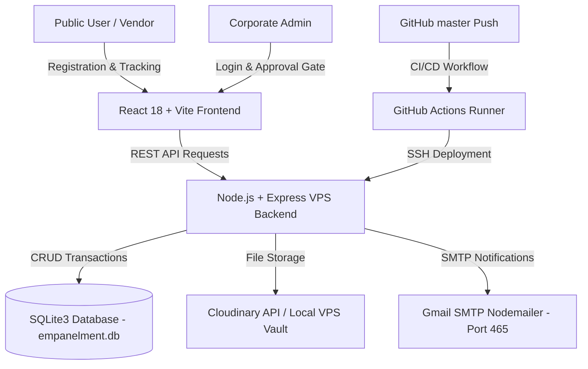

# 🏛️ HINDUSTAN PROJECTS — VENDOR EMPANELMENT PORTAL
## 📘 Official Architecture, Developer & Maintenance Guide

> **Live Subdomain**: `https://empanel.hindustanprojects.in`  
> **Production VPS Server**: `187.127.142.137` (Ubuntu Linux)  
> **GitHub Repository**: `https://github.com/hindustan-groups/Empanelment-Portal.git`  
> **Main Branch**: `master`

---

## 📌 Executive Overview

The **Hindustan Projects Empanelment Portal** is an enterprise-grade, full-stack web application designed for **Hindustan Projects**. It digitizes, automates, and secures the onboarding, statutory auditing, tier classification, and lifecycle management of vendors, contractors, consultants, and material suppliers across India.

---

## 🛠️ Technology Stack & System Architecture



| Layer | Component | Description |
| :--- | :--- | :--- |
| **Frontend** | React 18, Vite 8, Lucide React, React Router v6 | SPA with Glassmorphism design, mobile responsive UI, and custom HSL design tokens. |
| **Backend API** | Node.js, Express.js, Crypto, Multer, Nodemailer | Port 5000 REST API server managing multi-part uploads, security hashes, DB schemas, and email triggers. |
| **Database** | SQLite3 (`backend/empanelment.db`) | Relational database storing vendors, tickets, invoices, contact inquiries, tenders, and work orders. |
| **Storage** | Cloudinary Cloud API + VPS Storage | Secure vault for GST certificates, PAN cards, Bank cancelled cheques, experience letters, and photos. |
| **Emails** | Nodemailer (Gmail SMTP - Port 465 SSL) | Transactional email delivery engine with 5 automated HTML email templates. |
| **Deployment** | GitHub Actions + Linux VPS (PM2 + Nginx) | Automated CI/CD pushing code to VPS `187.127.142.137` on `git push origin master`. |

---

## 📁 Directory & File Structure

```text
empanelment-portal/
├── backend/
│   ├── server.js              # Express API Server, SQLite DB schemas, routes
│   ├── emailService.js        # Nodemailer SMTP transporter & email triggers
│   ├── emailTemplates.js      # HTML Email Templates (Vendor Confirmation, Admin Alert, Approval)
│   ├── empanelment.db         # SQLite Production Database
│   └── package.json           # Backend node dependencies
├── src/
│   ├── components/
│   │   ├── EmpanelmentForm.jsx    # 4-Step Vendor Registration Form & Advanced Submit Button
│   │   ├── SuccessModal.jsx       # Registration Success & A4 Dossier Preview Modal
│   │   ├── VendorIdCardModal.jsx  # Smart PVC ID Card Modal & Photo Upload Handler
│   │   ├── ContractManager.jsx    # Contracts & Work Order Manager
│   │   └── Logo.jsx               # Corporate SVG Logo Component
│   ├── config/
│   │   ├── api.js                 # API base URL configuration & resolution logic
│   │   └── categoryFieldsConfig.js# Category-specific fields & statutory license schemas
│   ├── pages/
│   │   ├── Home.jsx               # Portal Landing Page
│   │   ├── ApplyPage.jsx          # Empanelment Registration Page
│   │   ├── TrackPage.jsx          # Live Multi-Search Tracking Page (Tracking ID/GSTIN/PAN/Email)
│   │   ├── ContactPage.jsx        # Helpdesk Contact Us Page (Logs directly to Admin Panel)
│   │   ├── TendersPage.jsx        # Live Tenders Portal Page
│   │   ├── AdminLoginPage.jsx     # Admin Authentication Page (Bruteforce & Lockout protected)
│   │   ├── AdminPage.jsx          # Corporate Admin Control Panel (Applications, Contacts, Tenders)
│   │   ├── VendorLoginPage.jsx    # Vendor Portal Login Page (Approval Gate Protected)
│   │   └── VendorDashboardPage.jsx# Approved Vendor Self-Service Portal
│   ├── utils/
│   │   └── printDossier.js        # Pixel-perfect 4-Page A4 PDF Dossier Generator
│   └── App.jsx                    # Main React Application Routing & Context
├── scripts/
│   └── test-form.js           # Automated CLI Form Submission Tester
└── README.md                  # Developer & Architecture Guide
```

---

## 🗄️ Database Schemas (SQLite3)

The backend database (`backend/empanelment.db`) contains 6 core relational tables:

```sql
-- 1. Vendors Master Table
CREATE TABLE IF NOT EXISTS vendors (
  id INTEGER PRIMARY KEY AUTOINCREMENT,
  tracking_id TEXT UNIQUE NOT NULL,
  hash_signature TEXT NOT NULL,
  category TEXT NOT NULL,
  primary_role TEXT,
  company_name TEXT NOT NULL,
  entity_type TEXT,
  est_year TEXT,
  owner_name TEXT,
  contact_name TEXT NOT NULL,
  designation TEXT,
  email TEXT NOT NULL,
  phone TEXT NOT NULL,
  address TEXT, city TEXT, state TEXT, pincode TEXT,
  gstin TEXT, pan TEXT, aadhar_no TEXT, msme_no TEXT,
  bank_account TEXT, bank_name TEXT, ifsc TEXT,
  turnover_2023 TEXT, turnover_2024 TEXT, turnover_2025 TEXT,
  gst_doc TEXT, pan_doc TEXT, bank_doc TEXT, exp_doc TEXT,
  passport_photo TEXT, signature_data TEXT,
  status TEXT DEFAULT 'Under Verification',
  current_stage TEXT DEFAULT 'Financial & Technical Committee Audit',
  login_password TEXT,
  submitted_at DATETIME DEFAULT CURRENT_TIMESTAMP,
  approved_at DATETIME
);

-- 2. Contact Inquiries Table
CREATE TABLE IF NOT EXISTS contact_messages (
  id INTEGER PRIMARY KEY AUTOINCREMENT,
  name TEXT NOT NULL,
  email TEXT NOT NULL,
  phone TEXT NOT NULL,
  company TEXT,
  department TEXT,
  message TEXT NOT NULL,
  status TEXT DEFAULT 'NEW',
  created_at DATETIME DEFAULT CURRENT_TIMESTAMP
);

-- 3. Tenders Table
CREATE TABLE IF NOT EXISTS tenders (
  id INTEGER PRIMARY KEY AUTOINCREMENT,
  tender_no TEXT UNIQUE NOT NULL,
  title TEXT NOT NULL,
  category TEXT NOT NULL,
  location TEXT,
  estimated_value TEXT NOT NULL,
  due_date TEXT NOT NULL,
  status TEXT DEFAULT 'ACTIVE',
  created_at DATETIME DEFAULT CURRENT_TIMESTAMP
);

-- 4. Invoices Table
CREATE TABLE IF NOT EXISTS invoices (
  id INTEGER PRIMARY KEY AUTOINCREMENT,
  invoice_no TEXT UNIQUE NOT NULL,
  vendor_tracking_id TEXT NOT NULL,
  vendor_name TEXT NOT NULL,
  amount REAL NOT NULL,
  work_order_no TEXT,
  date TEXT NOT NULL,
  status TEXT DEFAULT 'UNDER REVIEW',
  rtgs_ref TEXT,
  created_at DATETIME DEFAULT CURRENT_TIMESTAMP
);

-- 5. Support Tickets Table
CREATE TABLE IF NOT EXISTS tickets (
  id INTEGER PRIMARY KEY AUTOINCREMENT,
  ticket_no TEXT UNIQUE NOT NULL,
  vendor_tracking_id TEXT NOT NULL,
  vendor_name TEXT NOT NULL,
  subject TEXT NOT NULL,
  category TEXT NOT NULL,
  status TEXT DEFAULT 'OPEN',
  reply TEXT,
  created_at DATETIME DEFAULT CURRENT_TIMESTAMP
);

-- 6. Work Orders Table
CREATE TABLE IF NOT EXISTS work_orders (
  id INTEGER PRIMARY KEY AUTOINCREMENT,
  order_no TEXT UNIQUE NOT NULL,
  vendor_tracking_id TEXT NOT NULL,
  vendor_name TEXT NOT NULL,
  project_title TEXT NOT NULL,
  value TEXT NOT NULL,
  due_date TEXT NOT NULL,
  status TEXT DEFAULT 'Active',
  created_at DATETIME DEFAULT CURRENT_TIMESTAMP
);
```

---

## 📡 Core API Reference

| Endpoint | Method | Access | Description |
| :--- | :--- | :--- | :--- |
| `/api/empanelment/submit` | `POST` | Public | Accepts multipart form data, saves vendor, generates SHA-256 hash & fires emails. |
| `/api/empanelment/status/:id` | `GET` | Public | Multi-search tracking API (Tracking ID, GSTIN, PAN, Email, Company). |
| `/api/empanelment/contact` | `POST` | Public | Saves Helpdesk message to DB & sends Admin alert email. |
| `/api/tenders` | `GET` | Public | Fetches active tenders list. |
| `/api/empanelment/vendor/login` | `POST` | Vendor | Authenticates approved vendors & returns session payload. |
| `/api/empanelment/admin/login` | `POST` | Admin | Server-side passcode check, issuing token & adminKey. |
| `/api/empanelment/admin/applications` | `GET` | Admin Protected | Returns all vendor applications. |
| `/api/empanelment/admin/status` | `PATCH` | Admin Protected | Updates status (Approved, Rejected, Clarification) & sends vendor email. |
| `/api/empanelment/admin/contacts` | `GET` | Admin Protected | Returns all Contact Us inquiries. |
| `/api/empanelment/admin/contacts/:id` | `PATCH` | Admin Protected | Toggles inquiry status (`NEW` / `RESOLVED`). |

---

## 🔒 Security Architecture

1. **Admin Security**:
   - 4-hour token validity & server passcode verification.
   - 3-attempt bruteforce lockout guard (60s timer).
   - Server-side `adminAuthMiddleware` checking `x-admin-key`.
2. **Vendor Approval Gate**:
   - Vendor login (`/vendor-login`) is strictly locked until Admin marks status as `Approved`. Unapproved/Pending/Rejected vendors cannot access `/vendor-dashboard`.
3. **Smart PVC ID Card Security**:
   - ID card view modal is restricted to Vendor & Admin dashboards. Public tracking page displays verification status without exposing raw credentials.
4. **Data Integrity**:
   - SHA-256 cryptographic hash generated upon submission for tamper-proof audit trail.

---

## 💻 Local Development Setup

```bash
# 1. Clone & Navigate
git clone https://github.com/hindustan-groups/Empanelment-Portal.git
cd Empanelment-Portal

# 2. Install Frontend & Backend Dependencies
npm install
cd backend && npm install && cd ..

# 3. Start Backend Server (Port 5000)
node backend/server.js

# 4. In a separate terminal, start Frontend Dev Server (Port 5173)
npm run dev
```

---

## 🐙 Git & Auto-Deploy Guide

This repository is connected to **GitHub Actions Auto-Deploy** targeting the Linux VPS (`187.127.142.137`).

### To deploy any code update:

```bash
# 1. Check changed files
git status

# 2. Stage & Commit
git add .
git commit -m "Describe your update clearly"

# 3. Push to GitHub master branch
git push origin master
```

### What happens automatically:
1. Code pushes to GitHub `master` branch.
2. GitHub Actions CI/CD runner triggers SSH connection to VPS `187.127.142.137`.
3. VPS runs `git pull`, `npm run build`, and `pm2 restart all`.
4. Changes go live on `https://empanel.hindustanprojects.in` within **20-30 seconds**.

---

## 🧪 Testing Tools

Run automated CLI form submission test against local or live API:

```bash
# Test local backend
npm run test:form http://localhost:5000

# Test live VPS backend
npm run test:form http://187.127.142.137:5000
```

---

## 📝 Maintenance Checklist for Future Developers

1. **Adding a New Field to Vendor Form**:
   - Update state in `EmpanelmentForm.jsx`.
   - Update SQLite columns / `params` array in `backend/server.js`.
   - Update `printDossier.js` to include field in printed PDF.
2. **Modifying Email Templates**:
   - Edit HTML functions in `backend/emailTemplates.js`.
3. **Database Backups**:
   - SQLite database is located at `backend/empanelment.db` on VPS. Back up this single file periodically.
